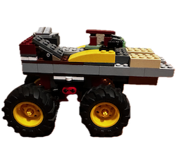

# Rover

A side scrolling game where you drive a rover, jump and avoid obstacles, and other fun things.

## Gameplay

### Movement

* Left and Right arrow keys to move
* Spacebar to jump, you can jump while in the air to jump hire

## Command line options

* `-speed N` Set the general game speed 1 - 60 ticks per second. Default is 30.
* `-debug` Print some debug information t the screen and the console.
* `-width N` Set the width of the screen. Default is 800.
* `-height N` Set the height of the screen. Default is 600.

## Graphics

Graphics by Matt. Nathan created the Lego builds that were used for the assets.

## TODO

* Implement max jump height
* Graphics
  * fire rockets on jump
  * flip vehicle direction  
  * scale background
  * rotate
* Obstacles
* Score
* Objective of the game?
